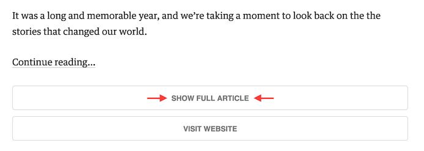

# FullyFeedly

### Chrome extensions to read the full articles in Feedly.com

With FullyFeedly you can load the full content of the articles inside Feedly, also when the feed RSS contains only a short preview.

## Features

* Seamless integration with Mercury API
* Super fast keyboard shortcut
* Works great with HTTPS connection

## Usage

When reading an incomplete post, simply press the icon of FullFeedly in the URL bar to download the full text.

You can also enable the keyboard shortcut from the options page and display the full article with **f f**

## Developers

Pull requests are very welcome!! :+1:

If you want to help read the [contributors guidelines](CONTRIBUTING.md) of this repository.

Thanks a lot to the following developers for their help and contributions:

* [@patou](https://github.com/patou)
* [@churchs19](https://github.com/churchs19)
* [@pamarcos](https://github.com/pamarcos)

### External API

The text of the article is extracted using the web API provided by:

* [Mercury](https://mercury.postlight.com/): **recommended**, free for non-commercial use, API key required
* [Boilerpipe](http://boilerpipe-web.appspot.com/): free to use, limited quota
